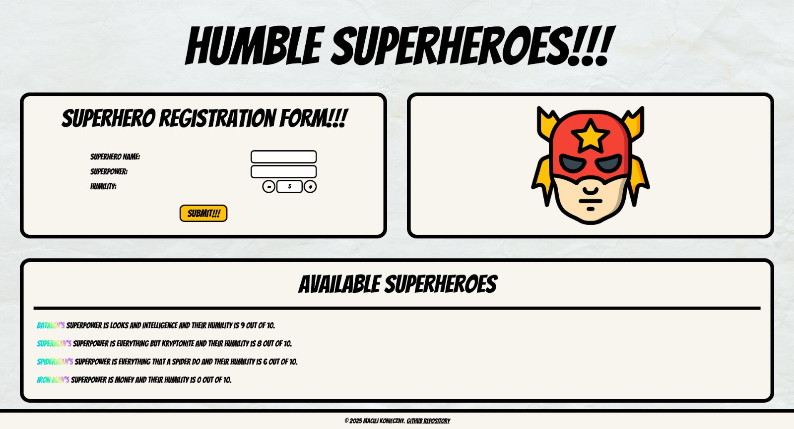
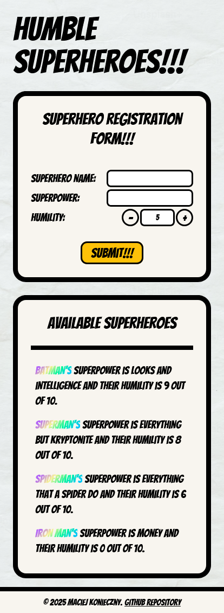

# Humble Superhero API

This project implements a simple API for managing a list of superheroes, focusing on their humility scores. It includes a visually appealing, functional, and responsive user interface and implements database in a simplified way - as a variable on a server.

  
  


## Table of contents

## Objective

The goal of this project was to create an API using Node.js framework that allows users to:

1. Add a new superhero with their name, superpower, and humility score (a rating out of 10).
2. Retrieve a list of superheroes sorted by their humility score in descending order (most humble first).

Also, done side quests included:
3. Creating a React interface where users can add superheroes and see the sorted list in real-time.
4. Adding validation to ensure the humility score is a number between 1 and 10.
5. Writing tests for endpoints using Jest.

## Project Structure

This project includes both frontend and backend.

### Backend
* Code is available in `/server` directory.
* Built with [Fastify](https://fastify.dev/).
* Uses an in-memory database (an array) for storing superhero data.
* Implements three endpoints:
    * `GET '/ping'`: Checks if the server is available.
    * `POST /superheroes`: Adds a new superhero (`name`, `superpower`, and `humilityScore` are required in body object).
    * `GET /superheroes`: Retrieves the list of superheroes, sorted by humility in descending order.
* Includes tests written in Jest.

### Frontend
* Code is available in `/client` directory.
* Features a React + Vite + Tailwind interface that allows users to add superheroes and view the sorted list in real-time by connecting to the server API.

### Database

There is no traditional database connection implemented, because it was not in the task requirements. Instead, a variable `superheroes` on the server keeps track of all default and added superheroes as long as the server is running.

## Installation

1. Clone the repository:
```git clone https://github.com/ifmcjthenknczny/humble-superhero-api```
2. Install yarn if you don't have it already:
```npm install --global yarn```
3. Navigate to the backend directory:
```cd server```
4. Install dependencies:
```yarn install```
5. Run the backend:
```yarn start```  
(or `yarn dev` to run watch wode for development)
6. Leave the server running while proceeding with the next steps
7. Navigate to the frontend directory:
```cd ../client```
8. Install frontend dependencies:
```yarn install```
9. Run the frontend:
```yarn start```  
(or `yarn dev` to run watch wode for development)

After these steps, the backend should be running on `http://localhost:8080/`, while the frontend should be running on `http://localhost:5173`.

## Technologies Used

* Fastify 5.2.1
* React 19.0.0
* Tailwind 4.0.6
* Typescript 5.7.2
* Vite 6.1.0

### Other Notable packages

- Axios 1.7.9
- ClassNames 2.5.1
- ESLint 9.20.0
- Prettier 3.5.0
- TS-Jest 29.2.5
- TSX 4.19.2
- Zod 3.24.1

## Useful Scripts

To maintain consistent code style and quality, both `/server` and `/client` directories have `yarn checkAll` command, which formats, lints (with automatic fixing) and builds the code.

## API Usage
* **Adding a Superhero `(POST /superheroes)`:**
```bash
curl -X POST -H "Content-Type: application/json" -d '{
  "name": "Captain Humility",
  "superpower": "Super Empathy",
  "humilityScore": 10
}' http://localhost:8080/superheroes
```

`humilityScore` is coerced automatically to number. It must be a number between 0 and 10. `name` and `superpower` both must be strings with character limit of 256.

* **Fetching Superheroes `(GET /superheroes)`:**
```bash
curl http://localhost:8080/superheroes
```

* **Pinging the server `(GET /ping)`:**
```bash
curl http://localhost:8080/ping
```

## Collaboration
If I were collaborating with a teammate on this project I would:
- Focus on improving data persistence by exploring the integration of a proper database (such as PostgreSQL or MongoDB) instead of using an in-memory array. This would make the API more robust and scalable.
- Assess the need for authentication and authorization to secure the API.
- Discuss deployment strategies, necessary server and client configuration changes, and improvements in CI/CD pipelines.

## If I had more time
### Frontend enhancements
- Write unit and integration tests.
- Refactor component code and improve variable/function names (especially those in `input` directory).
- Explore a global state solution for `refreshCount`, which may be necessary in the future.
- Improve responsiveness for certain screen widths.
- Prevent possible overlaps of `Loader` component.
- Fix the issue where validation errors sometimes disappear too quickly.
- Add input validation on the frontend.
- Expand Tailwind's custom values for better styling consistency.
- Enhance overall styling.

### Backend enhancements
- Write more comprehensive unit and integration tests.
- Implement pagination for the `GET /superheroes` endpoint to efficiently handle a large number of superheroes.
- Improve error handling and input validation, including more descriptive error messages.
- Automate `apiWrapper` injection across all backend endpoints.
- Redesign the superhero list display to a different format—perhaps each superhero could have their own card in `ListPanel.tsx`

### General improvements
- Convert the project to a monorepo and add Husky hooks.

## License
This work is licensed under the [MIT License](https://en.wikipedia.org/wiki/MIT_License).

## Author
Maciej Konieczny - [ifmcjthenknczny](https://github.com/ifmcjthenknczny)